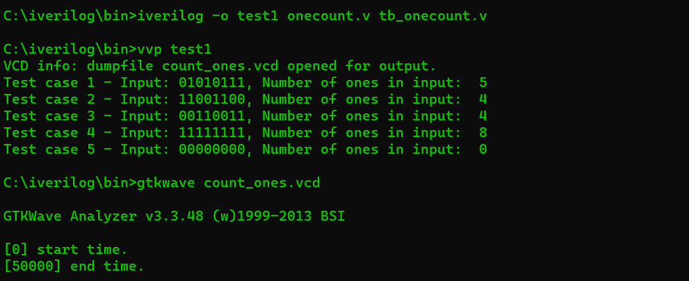
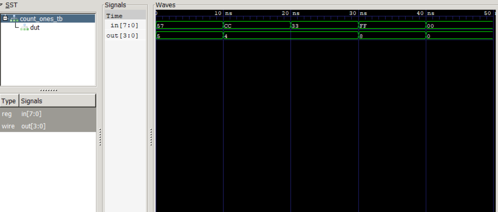

# Count number of one's in given binary input
## Overview

The `count_ones` module is a simple Verilog module that takes an 8-bit input vector and outputs a 4-bit vector representing the count of ones in the input vector. The module uses a combinational always block to perform the counting.

## Module Description

### Inputs

- `in` (8-bit): Input vector to count the number of ones.

### Outputs

- `out` (4-bit): Output vector representing the count of ones in the input.

### Module Implementation

```verilog
//onecount.v
module count_ones (
    input [7:0] in,
    output reg [3:0] out
);
always @(*) begin
    out = in[0] + in[1] + in[2] + in[3] + in[4] + in[5] + in[6] + in[7];
end
endmodule
```
# Simulation of count_ones Verilog Module

## Overview

This guide provides instructions on how to simulate the `count_ones` Verilog module using the provided testbench (`tb_onecount.v`).

## Simulation Steps

1.**Open a Terminal:**
    Open a terminal window in the directory containing the Verilog files.

2.**Compile Verilog Files**
    Compile the `count_ones` module and the testbench using your Verilog simulator. For example:

    iverilog -o test1 onecount.v tb_onecount.v

3.**Run Stimulate**
    Run the simulation using vvp, which is a utility that executes compiled Verilog simulations:

    vvp test1

4.**View Waveform**
    Open the waveform viewer (e.g., ModelSim or VCS or GTKwave) to visualize the simulation results. If you are using Gtkwave, you can type the following command in the console:

    gtkwave count_ones.vcd

5.**Analyse Waveform**
    In the waveform viewer, you will see the signals in and out for each test case. The out signal represents the count of ones in the corresponding in vector.

# count_ones Verilog Module Testbench

## Overview

This guide provides an explanation of the `tb_onecount.v` testbench, which is designed to verify the functionality of the `count_ones` Verilog module.

## Testbench Overview

The testbench (`tb_onecount.v`) is responsible for testing various scenarios of the `count_ones` module. It includes several test cases, each with different 8-bit binary inputs (`in`). The expected output (`out`) is printed for each test case, allowing for easy verification of the `count_ones` module.

### Testbench Code Explanation

```verilog
// tb_onecount.v
`timescale 1ns / 1ps

module count_ones_tb;
  reg [7:0] in;
  wire [3:0] out;

  // Instantiate count_ones module
  count_ones dut (
    .in(in),
    .out(out)
  );

  // Initial block for simulation setup
  initial begin
    $dumpfile("count_ones.vcd"); // Set the name of the VCD file
    $dumpvars(0, count_ones_tb); // Dump all variables in the testbench

    // Test case 1
    in = 8'b01010111;
    #10;
    $display("Test case 1 - Input: %b, Number of ones in input: %d", in, out);

    // Test case 2
    in = 8'b11001100;
    #10;
    $display("Test case 2 - Input: %b, Number of ones in input: %d", in, out);

    // Test case 3
    in = 8'b00110011;
    #10;
    $display("Test case 3 - Input: %b, Number of ones in input: %d", in, out);

    // Test case 4
    in = 8'b11111111;
    #10;
    $display("Test case 4 - Input: %b, Number of ones in input: %d", in, out);

    // Test case 5
    in = 8'b00000000;
    #10;
    $display("Test case 5 - Input: %b, Number of ones in input: %d", in, out);

    $finish; // End the simulation
  end

  // Simulation loop to keep the simulation running
  always begin
    #1; // Wait for 1 time unit
  end

endmodule
```
##OUTPUT SCREEN




